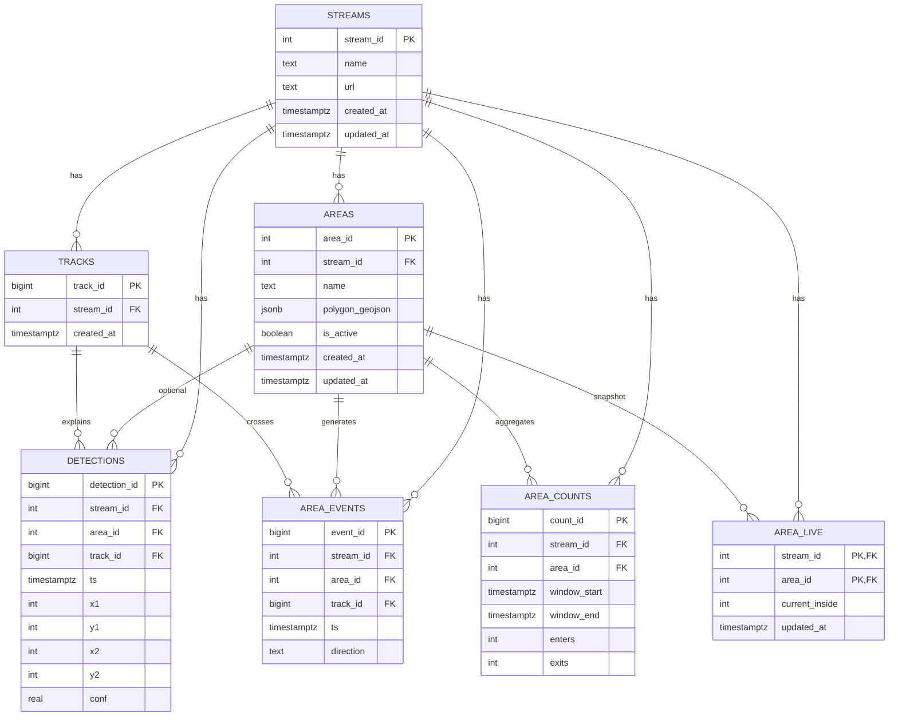

# 📂 Database Diagram – People Counting

## Entity Relationship Diagram (ERD)

```mermaid
erDiagram
  STREAMS ||--o{ AREAS : has
  STREAMS ||--o{ TRACKS : has
  STREAMS ||--o{ DETECTIONS : has
  STREAMS ||--o{ AREA_EVENTS : has
  STREAMS ||--o{ AREA_COUNTS : has
  STREAMS ||--o{ AREA_LIVE : has

  AREAS ||--o{ DETECTIONS : optional
  AREAS ||--o{ AREA_EVENTS : generates
  AREAS ||--o{ AREA_COUNTS : aggregates
  AREAS ||--o{ AREA_LIVE : snapshot

  TRACKS ||--o{ DETECTIONS : explains
  TRACKS ||--o{ AREA_EVENTS : crosses

  STREAMS {
    int stream_id PK
    text name
    text url
    timestamptz created_at
    timestamptz updated_at
  }

  AREAS {
    int area_id PK
    int stream_id FK
    text name
    jsonb polygon_geojson
    boolean is_active
    timestamptz created_at
    timestamptz updated_at
  }

  TRACKS {
    bigint track_id PK
    int stream_id FK
    timestamptz created_at
  }

  DETECTIONS {
    bigint detection_id PK
    int stream_id FK
    int area_id FK
    bigint track_id FK
    timestamptz ts
    int x1
    int y1
    int x2
    int y2
    real conf
  }

  AREA_EVENTS {
    bigint event_id PK
    int stream_id FK
    int area_id FK
    bigint track_id FK
    timestamptz ts
    text direction
  }

  AREA_COUNTS {
    bigint count_id PK
    int stream_id FK
    int area_id FK
    timestamptz window_start
    timestamptz window_end
    int enters
    int exits
  }

  AREA_LIVE {
    int stream_id PK,FK
    int area_id PK,FK
    int current_inside
    timestamptz updated_at
  }
```
